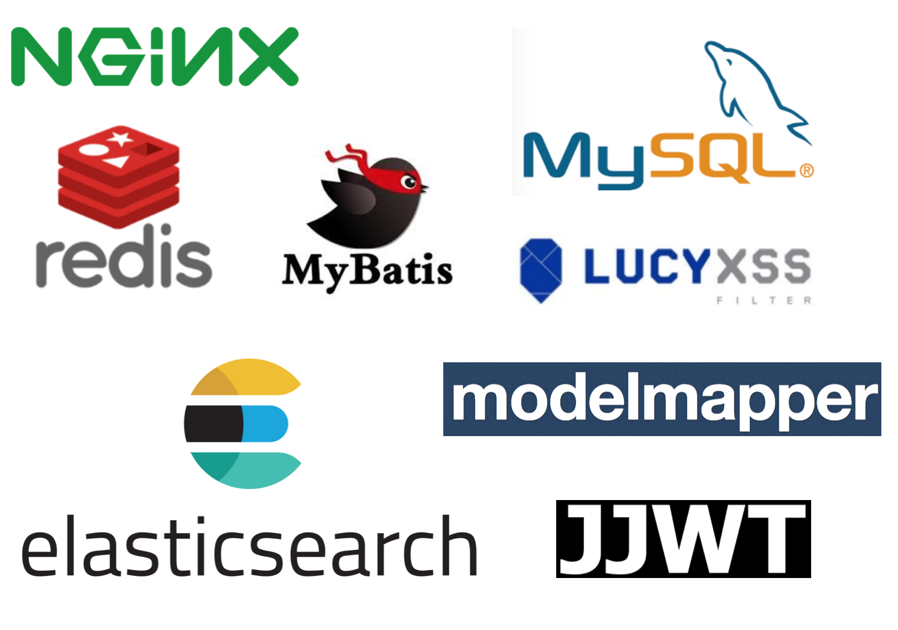

## '내 손안의 지하상가' 지상
---
2017년 12월 30일 - 2018년 1월 13일의 2주의 기간동안 SOPT라는 동아리의 구성원으로 활동 중이던 저는 동아리의 앱잼에 참여하였습니다. 지상 어플리케이션은 앱잼에서 진행한 프로젝트로 지하상가에서 판매되는 상품을 인터넷으로도 쇼핑이 가능하게 만들자는 목적에 탄생 되었습니다.

---
### 프로젝트에서 맡은 역할
---
지상 앱잼 팀은 프로젝트 매니저 두 명, 디자이너 두 명, IOS 두 명, 안드로이드 세 명, 서버 세 명이 한 팀이 되어 프로젝트를 진행하였으며 저는 서버 파트 A시드를 지정 받아 다른 시드의 팀원보다 더 책임감을 갖고 프로젝트에 임했던 기억이 납니다.

지상에서 제가 맡았던 역할은 지상 서버 사이드 어플리케이션의 모든 API를 구현하는 것이었습니다. 사정이 생겨 B시드의 팀원이 안드로이드 파트를 도와야만 하는 상황이 되었고 C시드의 팀원은 회사 생활 중이라 시간을 낼 수 없는 상황이었습니다. 물론 초기 데이터베이스 스키마 정의와 API 엔드포인트 정의 등은 세 명의 서버 파트 팀원이 함께 진행하였습니다.  

API 문서 작성과 코드 테스트는 B시드 팀원의 도움으로 함께 진행하였습니다.

---
### 프로젝트를 진행하면서 고려하였던 부분.
---

앱잼 전 팀을 꾸리기 위해 모인 데모데이 행사 당시 지상 어플리케이션에는 지도를 통한 사용자의 현재 위치 제공 및 마켓 위치 제공이라는 기능이 필요하여 여러 사람들로부터 화제가 되었습니다. 제가 지상 팀에 지원하게 된 이유도 사실 이 부분 때문이었습니다. 그러나 안타깝게도 지하상가 내에서는 GPS가 동작하지 않는다는 사실을 알게 되어 지도 부분에 대한 구현을 취소하게 되었습니다.

아쉽긴 했지만 마음을 다시 잡고 현재 구현 가능한 부분에 한해서 아주 잘 만들어보자는 생각으로 프로젝트에 임하였습니다.(`스프링 MVC를 기반으로 다시 제작한 현재 지상어플리케이션 구현에는 DEMO 지도 기능이 존재합니다.`) 지상 어플리케이션의 와이어 프레임(현재 디렉토리 내의 `jisang_wireframe.pdf`)의 지도 관련 기능을 제외한 나머지 화면을 보면 CRUD 로직이 대부분이었습니다. 기능이 간단해보인다고 구현을 간단하게 하지 않으려고 노력했습니다. 단지 기능의 동작 구현만 신경쓰지 않고 할 수 있는 한 가능한 시나리오를 생각해가며 예외 처리에 힘을 썼습니다. 이렇게 까지 코드를 짜야 하냐며 놀리는 팀원들도 있었습니다. 필요한 경우에는 클라이언트 팀원들 그리고 프로젝트 매니저와 상의하며 요청과 응답에 대한 세부사항을 조율하였습니다.

데이터베이스 스키마는 가급적 정규화를 하되 비즈니스 로직의 성능을 위해 역정규화를 한 경우도 있었습니다.

예를 들어, `tbl_images`라는 데이터베이스 테이블에는 상품의 이미지들의 url 정보가 저장되어 있었습니다. 상품의 이미지(의 url)를 `tbl_images`에만 저장해 둘 경우 매번의 상품 목록 요청마다 상품 테이블 `tbl_products`와 `tbl_images` 간의 JOIN이 발생해 응답이 느려지겠다는 생각이 들었고 이런 이유로 `representing_image`라는 칼럼을 `tbl_products`에 추가하는 방법으로(역 정규화) JOIN을 피해 응답 성능을 개선하였습니다.

어플리케이션은 크게 Controller Service Persistence의 3개의 계층으로 구성하였습니다. 어플리케이션의 전체 영역이 특정 화면에 종속되는 것을 줄이고자 (스스로 정하기를) 영속 계층으로의 입/출력은 화면에 보다 종속적인 `DTO` 오브젝트가 아닌 `Domain` 오브젝트만 오갈 수 있도록 정하였습니다. 이렇게 함으로써 영속 계층의 DAO 메서드의 재사용성을 조금이나마 향상시킬 수 있었다고 생각합니다.

---
### 기반 기술 
---

앱잼 당시에는 Node.js로 지상 어플리케이션을 개발하였으나 이 포트폴리오에서 다루는 지상 어플리케이션은 Spring MVC를 기반으로 작성되었습니다.

Legacy Spring을 최대한 잘 알아보려고 노력하였으며 스프링 MVC 기반 웹 서버 구현을 함에 있어 필요한 최대한 많은 내용을 프로젝트에 담아보려고 노력했습니다. 보다 더 자세한 내용은 `src/java/com/jisang` 이하의 각각의 패키지에 다루었습니다.

---
### 활용 기술 
---

NGINX - 리버스 프록시 적용을 위해 NGINX 서버를 지상 어플리케이션 origin 서버의 앞단에 배치하였습니다. 사용자가 지상 어플리케이션 서버에 직접 요청하는 것을 막을 수 있어 어플리케이션 보안에 보다 더 안전한 구조가 되었습니다.

LUCY XSS - 크로스 사이트 스크립팅 공격 방지를 위해 lucy xss filter를 적용하였습니다. 지상 어플리케이션의 기존 클라이언트가 웹 브라우저가 아닌 안드로이드, IOS와 같은 모바일 어플리케이션이기는 하나 후에 브라우저에서도 이용될 것을 고려한다면 lucy xss와 같은 보안 필터는 미리 적용해두는 것이 안전하다고 생각하였습니다. 필터가 적용되지 않아 잘못된 자바스크립트 코드가 댓글 content로 저장되어 버린 상태에서 웹 브라우저 클라이언트를 지원하게 될 경우 문제가 발생할 것이기 때문입니다.

MYSQL, MYBATIS - 지상 어플리케이션 전반에 사용되는 데이터베이스로 유명한 오픈 소스 RDB인 Mysql을 선택하였습니다. 가장 친숙한 RDBMS라 선택하였습니다. Mybatis의 경우 요즘은 덜하나 과거 우리나라에서 자주 이용되었다고하여 프로젝트를 수행하며 공부를 한 번 하는 것이 좋겠다는 생각으로 선택하게 되었습니다.

REDIS - Spring Security를 기반으로 JWT 유저 인증을 수행하는 지상 어플리케이션의 security 단에서 JWT 재생 공격에 대한 대책 강구를 위해 도입하게 된 dbms입니다. 보다 자세한 설명은 `src/main/com/jisang/security/README.md`에 다루었습니다.

ELASTICSEARCH - 상품 검색어 미리보기 기능에 elasticsearch가 사용되고 있습니다. 상품 검색 기능에까지 elasticsearch를 이용하려고 하였으나 고려해볼 사항이 있어 현재 상품 검색은  RDB(mysql)을 이용합니다. `src/main/com/jisang/web/product/README.md`에 보다 자세히 설명하였습니다.

JJWT - Spring security를 기반으로 JWT 유저 인증을 수행하는 지상 어플리케이션의 security 단에서 JWT building, parsing에 사용하는 라이브러리입니다. 

MODELMAPPER - modelmapper는 지상 어플리케이션의 서비스 계층에서 주로 활용하고 있습니다. modelmapper를 사용하기로 한 이유는 다음과 같습니다. (위에서) 영속 계층에서는 항상 도메인 오브젝트만을 입/출력으로 받기로 정하였다고 말했는데, 그러므로 영속 계층의 메서드를 호출하는 서비스 계층에서 컨트롤러로부터 전달 받은 DTO 오브젝트를 도메인 오브젝트로 변환시켜 주어야 합니다.(그 반대의 경우 포함.) 
이 때 modelmapper를 사용하면 DTO 클래스나 도메인 클래스에 새 프로퍼티가 추가되어도 서비스 로직 코드에 변경없이 안전한 변환(매핑)이 가능합니다. 물론 DTO 클래스에 도메인 오브젝트를 파라미터로 받는 생성자나 setter가 정의되어 있을 경우에도 위에 말한 서비스 로직 변경이 발생하지 않게 할 수 있습니다. 다만 이 방법의 경우 DTO 오브젝트의 프로퍼티가 새로 추가될 때 도메인 오브젝트를 인자로 받는 생성자나 setter메서드를 실수로 변경하지 않았을 경우 예상 못한 오류가 발생하거나 원하는 응답이 생성되지 않게 됩니다. 이런 점에서 modelmapper를 잘 이용하는 것이 좋겠다고 생각했습니다.

---
### 보다 자세한 설명과 코드
---

보다 자세한 설명은  `com/jisang/security/README.md`,`com/jisang/security/web/*/README.md` 등에 다루었으며 코드 레벨에서 어떤 이유로 이런 구현을 하였는지와 같은 더 자세한 설명은 각각의 코드에 주석으로 설명하였습니다. 

