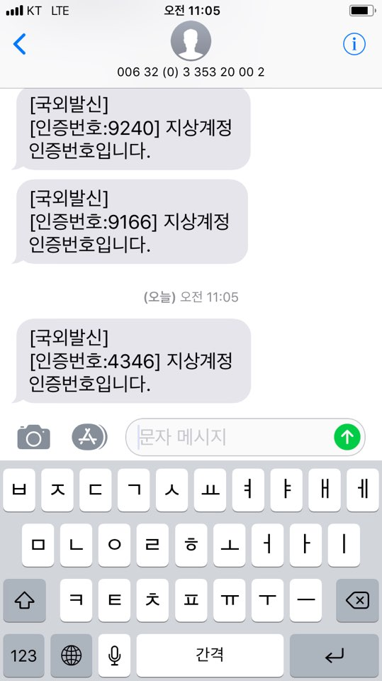

---
# Jisang  Security  
---
지상 어플리케이션의 시큐리티 단은 `Spring Security`를 기반으로 JWT token을 이용하여 사용자를 인증 합니다. 

JWT
---
지상 어플리케이션의 Security 단은 메모리 절약(세션과 비교하여)을 위해 JWT 토큰을 이용 합니다. 지상 어플리케이션에서 JWT는 로그인 유지, 인증 번호 요청 검증, 임시 비밀번호 발급 요청 검증 등에 다양하게 사용됩니다. 

지상 어플리케이션의 JWT 토큰 인증과정은 위와 동일합니다.

지상 security의 JWT 관련 컴포넌트는 [JJWT(Java JWT: JSON Web Token for Java and Android)](https://github.com/jwtk/jjwt)라는 라이브러리를 기반으로 구현하였습니다.

구현 과정에 했던 고민 등을 다룬 자세한 내용은 JWT 컴포넌트에 대한 자바 코드의 주석을 통해 다루었습니다.`com.jisang.security.service` 이하에 `JWTService`와 구현 클래스 등 JWT 관련 컴포넌트가 위치해 있습니다.

---

Redis
---
메모리 효율과 더불어 토큰에 간단한 정보를 저장하여 불필요한 I/O를 조금이나마 피할 수도 있기 때문에(RDB 등으로부터 데이터를 가져올 경우) JWT가 매우 매력적으로 보였습니다. 

그러나 JWT에 한가지 약점이 있었습니다. 재생 공격에 취약하다는 것입니다. 이를 위해 JWT에는 JTI라는 public claim이 존재합니다. JTI를 이용해 토큰 재생 공격을 방지하려면 JTI가 올바른지 검증하기 위해 서버에 JTI가 저장되어야만 했습니다. 

세션 사용 이유가 메모리 절약이었기 때문에 JWT 사용에 대한 근거가 미약해졌습니다만 그래도 JWT를 그대로 사용하기로 하였습니다. 이유는 비록 로그인 한 유저에 대한 JTI 필드는 서버에 저장되지만 그 외 user id, user role 등의 정보는 JWT token에 저장할 수 있어 조금이나마 메모리 절약이 가능하다는 생각에서였습니다. 물론 디스크에 정보를 저장해도 되겠지만 이는 긴 지연시간을 요구하므로 배제하였습니다. 

결국 JTI를 redis에 저장하기로 하였습니다. 

>톰캣 세션에 저장해도 되었을 법한데 이 때 당시에는 단순히 **톰캣 세션이 클러스터 환경에서 별로 좋지않	다.**라고만 알고 (물론 지상 어플리케이션은 단일 서버로 구성되어 있지만 클러스터 환경에 대한 고려도 미리 하면 좋겠다는 생각을 하였습니다.) 단일 저장소 redis에 JTI를 저장하기로 하였습니다. 
이 때 당시에는 또한 'spring session' 프로젝트의 존재를 몰랐습니다. 또한 톰캣에서 세션 저장소로 redis 서버를 지정할 수 있다는 사실도 몰랐습니다)

 
`Redis`에 저장되는 JTI 정보는 매번 토큰 인증시마다 비교됩니다.

---
Login
---

로그인에 관여하는 컴포넌트는 다음과 같습니다. 
**( prefix = com.jisang.security ) **
	- prefix.authentication.JWTLoginAuthenticationFilter

	- prefix.authentication.provider.JWTLoginAuthenticationProvider(와 ProviderManager)

	- prefix.core.userdetails.DefaultUserDetailsService

	- prefix.service.UserAuthJWTService

	- prefix.persistence.RedisUserDAO
 다음은 위 컴포넌트의 콜래보레이션에 대해 도식화한 그림입니다.

 

로그인 과정의 동작은 `spring security`의 form login 동작과 거의 유사합니다.
`JWTLoginAuthenticationFilter`는 `JWTLoginAuthenticationProvider`에 인증 작업을 맡기며 `JWTLoginAuthenticationProvider`는 `DefaultUserDetailsService`를 호출하여 사용자의 아이디 및 패스워드를 기반으로 한 인증을 수행합니다. 
인증에 성공하였을 경우 `JWTLoginAuthenticationFilter`의 *successfulAuthentication()* 메서드에서는 JTI 저장을 위해 `RedisUserDAO`를 호출하며 JWT building을 위해 `UserAuthJWTService`를 호출한 후 생성된 JWT 토큰을 헤더에 담아 클라이언트로 응답을 수행합니다.
  다음은 `POSTMAN`으로 LOGIN을 수행 해본 결과입니다.
 
- POST /login

test 용으로 `/signup/manager` 엔드포인트에 회원가입 요청을하여 생성된 유저에 대한 로그인 결과입니다. 로그인에 성공하여 아래와 같이 201 Created 응답과 'Bearer :'으로 시작하는 JWT 토큰이 응답 헤더에 전달되었음을 알 수 있습니다.

로그인시에 해당 유저에 대한 jti가 `Redis`에 저장되었음을 알 수 있습니다.

>로그인 컴포넌트 관련 보다 더 자세한 내용은 해당 컴포넌트를 구성하는 클래스 코드에 주석으로 자세히 설명하였습니다.

---
token authentication
---
기본 JWT 토큰 인증 과정에 관여하는 컴포넌트는 다음과 같습니다.
**( prefix = com.jisang.security ) **
	- prefix.authentication.JWTTokenAuthenticationFilter
	
    - prefix.authentication.provider.JWTTokenAuthenticationProvider

	- prefix.service.UserAuthJWTService

	- prefix.persistence.RedisUserDAO

 다음은 위 컴포넌트의 콜래보레이션에 대해 도식화한 그림입니다.

 

토큰 인증과정의 동작은 다음과 같습니다. 우선 요청 헤더로부터 JWT token을 추출한 `JWTTokenAuthenticationFilter`는 `UserAuthJWTService`를 호출해 JWT를 파싱합니다. 파싱된 토큰 정보는 `JWTTokenAuthenticationProvider`에 전달되며 해당 정보를 이용하여 `JWTTokenAuthenticationProvider`에서 JTI 검사를 수행합니다.
 
>위와 같은 토큰 인증 과정은 `/auth`로 시작되는 모든 인증 절차에 이용됩니다. 토큰 인증 컴포넌트 관련 보다 더 자세한 내용은 해당 컴포넌트를 구성하는 클래스 코드에 주석으로 자세히 설명하였습니다.

---
임시 비밀번호 발급
---

지상 어플리케이션의 와이어 프레임에는 아래와 같은 익명 사용자의 비밀번호 변경 화면이 존재합니다.
(비밀 번호를 기억 못할 경우)

이 부분을 (기존 Node 구현에서 Spring으로 변경하면서)화면과는 조금 다르게 기존의 비밀번호 변경이 아닌 서버에서 임시 비밀번호를 생성하여 이를 사용자에게 전달하는 방법으로 변경하였습니다.

동작은 *인증 번호 전송 및 인증 -> 토큰 인증 및 임시 비밀번호 생성 및 전달*의 과정으로 나뉘며 아래에 해당 과정을 자세히 설명하겠습니다.
 

- GET /authentication-number
 

익명 사용자는 임시 비밀번호를 발급 받기 전 인증 번호를 통한 인증을 수행해야 합니다. `/authentication-number` 엔드포인트로 GET 요청을 받을 경우 서버는 해당 사용자의 email과 함께 전달한 인증 번호 전송 목적지 정보(현재 구현은 핸드폰 번호)를 데이터베이스로부터 검사합니다. 사용자 email과 핸드폰번호가 일치할 경우 서버는 인증 번호 전송과 함께 인증 번호가 담긴 JWT token을 응답 헤더에 담아 사용자에게 전달합니다. 이 JWT token은 바로 다음에 사용자가 서버에 전달한 인증 번호가 올바른지를 검사하기 위해 사용됩니다.

	JWT payload에는 외부에 공개되어서는 안될 중요한 정보가 담겨선 안됩니다. 그러므로 인증 번호가 담긴 JWT token은 위험할 수 있으나, 이 때 사용되는 JWT token의 수명을 2분(현재)의 짧은 기한을 두었으며(사용자는 2분내에 전달된 인증번호를 서버에 전송하여야 함.) 또한 JWT 파싱시 IP가 동일한지를 검증하므로 안전하다고 생각하였습니다. 
    
아래는 /authentication-number 엔드포인트로의 GET 요청시 동작하는 컴포넌트의 콜래보레이션을 도식화한 그림입니다.

    
    
다음은 `POSTMAN`을 이용한 /authentication-number 엔드포인트로의 GET 요청 예입니다.

사진의 오른쪽 아래를 보면 서버로부터 `200 OK` 응답이 전달되었음을 알 수 있습니다. 핸드폰번호에 대한 인증이 완료되었기 때문에 다음과 같이 인증번호가 전달됩니다.
 

 

- POST /authentication-number

POST 메서드로 동일 엔드포인트에 인증 번호를 전달하면 서버는 인증 번호에 대한 인증 수행 후 해당 익명 사용자가 인증되었음을 알리는 JWT token을 전달합니다. 인증 번호에 대한 인증 수행이 완료된 후 바로 임시 비밀번호를 생성 및 전달하지 않는 이유는 후에 다른 인증 번호를 통한 인증이 필요한 시나리오가 존재할 경우를 대비하였기 때문입니다.

아래는 /authentication-number 엔드포인트로의 POST 요청시 동작하는 컴포넌트의 콜래보레이션을 도식화한 그림입니다.

다음은 `POSTMAN`을 이용한 /authentication-number 엔드포인트로의 POST 요청 예입니다.

 

- PATCH /temporary-password
위의 인증번호 인증이 성공하였을 경우 서버는 익명사용자가 인증되었음을 증명할 수 있는 JWT token을 전달합니다. 이 JWT에는 authenticated라는 `bool` 필드와(사실 꼭 필요한 것은 아닙니다.) 사용자의 IP 주소가 저장되어 있습니다. 위와 동일하게 2분의(현재) 기한이 지나면 만료되며 요청의 IP주소가 토큰의 IP와 일치하지 않을 경우 인증에 실패됩니다. 토큰 인증에 성공할 경우 필터는 doFilter()를 호출하여 요청을 뒷단으로 전달하며 해당 요청은 최종적으로 UserController의 issueTemporaryPassword() 메서드로 전달됩니다. 사용자에 대한 새로운 비밀번호를 생성하며(데이터베이스 변경) 해당 사용자의 이메일(현재)로 임시 비밀번호를 전송합니다. 

아래는 /temporary-password 엔드포인트로의 PATCH 요청시 동작하는 컴포넌트의 콜래보레이션을 도식화한 그림입니다.

다음은 `POSTMAN`을 이용한 /temporary-password 엔드포인트로의 PATCH 요청 예입니다.

`204 No Content`가 응답 상태로 전달되었고 

 

>참고로 로그인과 달리(UserController 포스트맨 실행 결과를 위해 생성한 유저 `user_id : 105`)위 과정은 실제 이메일로 진행하여야 하여 seunghx@naver.com 이라는 주소를 갖는 `user_id : 100`인 회원의 계정으로 수행하였습니다. 또한 화면에는 '비밀 번호 수정 화면에 아래의 임시 비밀번호를 입력'하라고 되어있으나(초기에는 이렇게 구현하였으나 임시 비밀번호(+ 비밀번호 변경)에 참여하는 컴포넌트가 너무 많아져 마지막 단계(전달된 임시 비밀번호를 입력하여 새 비밀번호로 변경)는 없앴습니다.)그냥 비밀번호를 변경하여 전달된 임시 비밀번호를 사용하도록 하였습니다.
>
>

위에 다룬 임시 비밀번호 발급 과정 관련 보다 더 자세한 내용은 해당 컴포넌트를 구성하는 클래스 코드에 주석으로 자세히 설명하였습니다.

