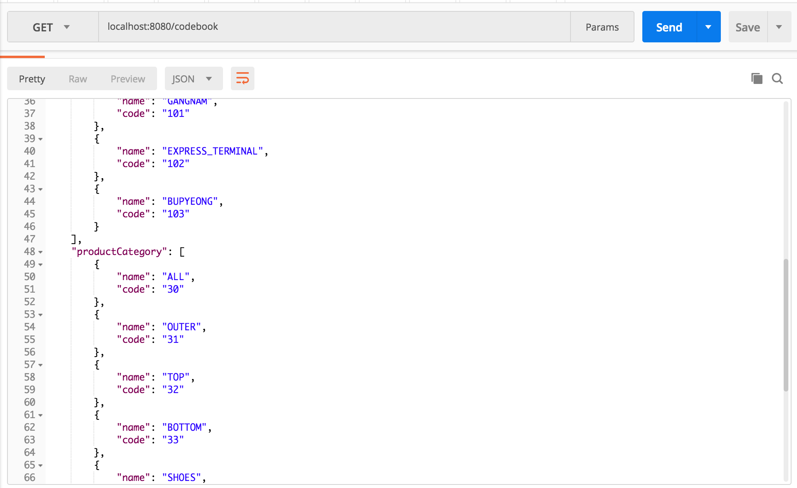
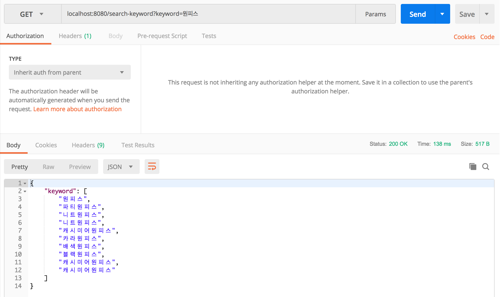
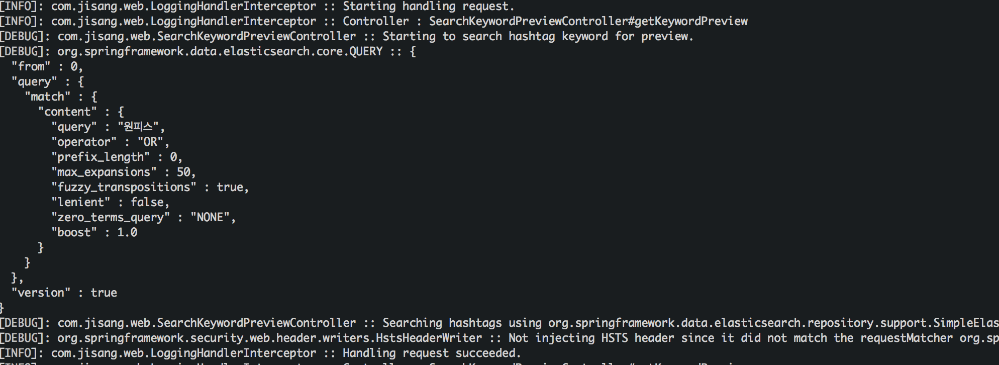

# com.jisang.web

`com.jisang.web` 패키지와 그 하위 패키지에는 사용자의 웹 요청을 처리하는 컨트롤러들이 구성되어 있습니다.

---
ApplicationController
---
`UserController`,`ProductController`와 같은 도메인 관련 엔드포인트에 대한 요청처리가 아닌 그 외의 요청에 대한 핸들러 메서드를 정의한 컨트롤러 클래스입니다. 현재는 서버와 클라이언트에서 공통으로 사용할 코드를 모아둔 `CodeBook`에 대한 GET 요청을 담당하는 핸들러 메서드만 존재합니다.



CodeBook GET 요청에 대한 보다 자세한 내용은 `api.md` 파일을 보면 알 수 있습니다.

---
SearchKeywordController
---
지상 어플리케이션은 해시 태그를 통한 상품 검색 기능이 있습니다. 이 해시 태그는 상품 등록 및 수정시에 상품 정보와 함께 서버에 저장됩니다. `SearchKeywordController`는 해시 태그 검색을 위한 타이핑 시 검색어 미리보기 기능을 담은 컨트롤러 클래스로 특정 도메인에 속하기도 애매하고 `ApplicationController`에 포함시키기도 애매하여 따로 분리하였습니다. 

아래에 키워드 검색에 대한 간단한 'POSTMAN' test를 보이겠습니다.



원피스라는 검색어에 대하여 다음과 같은 미리보기 결과가 응답됨을 알 수 있습니다. 

현재 이 기능은 `elasticsearch`로 query를 보내 응답에 보낼 결과를 얻어옵니다. 응답 속도를 위해 클라이언트에서 `elasticsearch`로 바로 쿼리를 보내게할까도 생각해보았으나 서버 어플리케이션 외부에서 `elasticsearch`에 접근하는 것은 안전한 방법은 아닌 것 같아 그렇게 하지는 않았습니다.  현재 `Arirang Analyzer Plugin`을 설치하여 한글 형태소 분석을 수행 중인데 현재 결과가 100 퍼센트 완벽하지 않아 사전 정보에 대한 수정이 필요한 상태입니다. 해시태그 키워드는 한글 형태소 분석이 적용되어 indexing 될 수 있도록 `text` 타입으로 저장되었으며 `match` 쿼리를 사용하여 받아오고 있습니다. 





위 사진은 

```
SearchQuery searchQuery = new NativeSearchQueryBuilder()
        					.withQuery(matchQuery("content", content))
        					.build();

```

의 코드가 만들어낸 해시 태그 검색시 사용된 `elasticsearch` query 문입니다.

---
그 외의 다른 컨트롤러 관련 내용은 각각의 패키지 폴더에 존재하는 `README.md` 파일에서 다루었으며 보다 더 자세한 내용은 각각의 자바 코드의 주석으로 다루었습니다.
