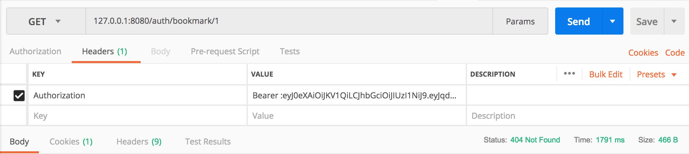
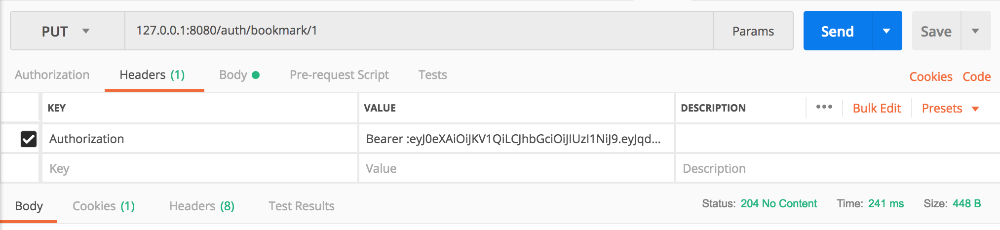
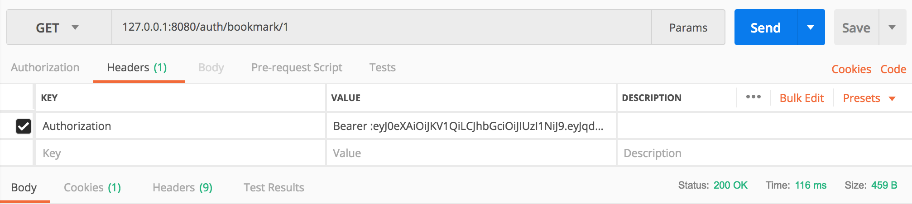
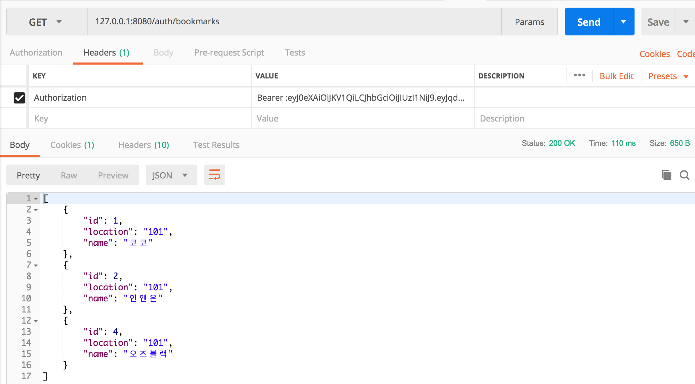

---
# BookMarkController 
---
BookMarkController는 유저의 마켓에 대한 북마크 관련 요청을 처리하는 핸들러 메서드들이 정의되어 있습니다. 북마크 정보는 지상 와이어프레임 상에 마켓 상품 목록 화면에 존재하는데 구현을 단순화하기 위해 다른 정보(상품 목록, 마켓 이름 등)와 다르게 북마크 정보만 추가 요청을 통해 가져오도록 하였습니다.

BookMarktController 및 bookMark 관련 보다 더 자세한 내용은 자바 코드의 주석을 통해 다루었습니다.

---
### GET /auth/bookmark/{marketId}
---
특정 마켓에 대해 사용자가 북마크(좋아요)를 지정했는지에 대한 정보를 반환합니다. 다른 핸들러 메서드와 다르게 이 엔드포인트에 대한 요청을 처리하는 핸들러 메서드에서는 기존 북마크 정보(좋아요 한 정보)가 없을 시에 `404 Not Found` 응답을 합니다.

아래와 같이 marketId:1 마켓에 대하여 기존 북마크 표시를 하지 않았을 경우 `404 Not Found` 상태 코드가 응답에 포함됨을 알 수 있습니다.

---
### PUT /auth/bookmark/{marketId}
---

토글 방식으로 북마크 정보를 변경합니다. (북마크 on 상태에서 클릭하면 off가 되고 off 상태에서 클릭하면 on이 되는..)

이제 1번 마켓에 대한 북마크가 설정되었으므로 `/auth/bookmark/1`로 `GET` 요청을 하면 

와 같이 `200 OK` 상태 코드가 응답에 포함됨을 알 수 있습니다.

---
### GET /auth/bookmarks
---
유저가 북마크 한 마켓 목록을 반환합니다.

해당 유저 계정이 id:1, id:2, id:4 마켓에 대하여 북마크(좋아요)하였음을 알 수 있습니다.

