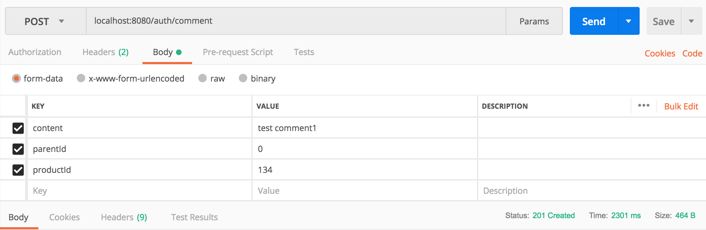
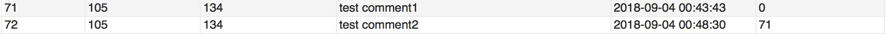
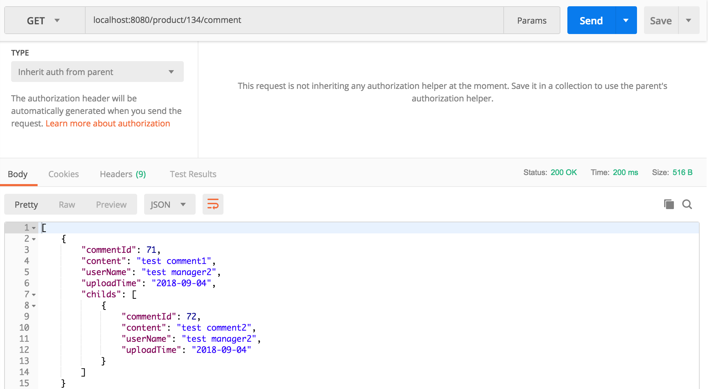

---
# CommentController 
---
CommentController는 댓글 관련 요청을 처리하는 요청 핸들러 메서드들이 정의되어 있습니다. 
CommentController 및 comment 도메인 관련 보다 더 자세한 내용은 자바 코드의 주석을 통해 다루었습니다.

---
POST /auth/comment
---
특정 상품에 댓글을 등록합니다.

아래는 추가된 댓글과 이 댓글에 대한 자식 댓글을 하나 더 추가하여 조회한 db 레코드 결과입니다.

---
GET /product/{productId}/comment
---
상품 id(productId)에 해당하는 상품의 댓글 정보(목록을) 반환합니다.

바로 위에서 등록한 댓글과 해당 댓글의 자식 댓글을 추가하여 수행한 결과입니다.

---
