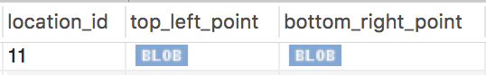
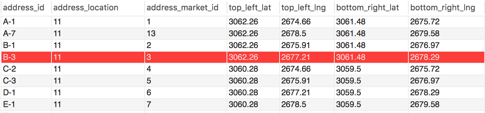
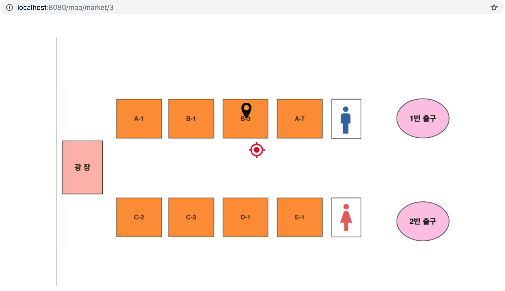
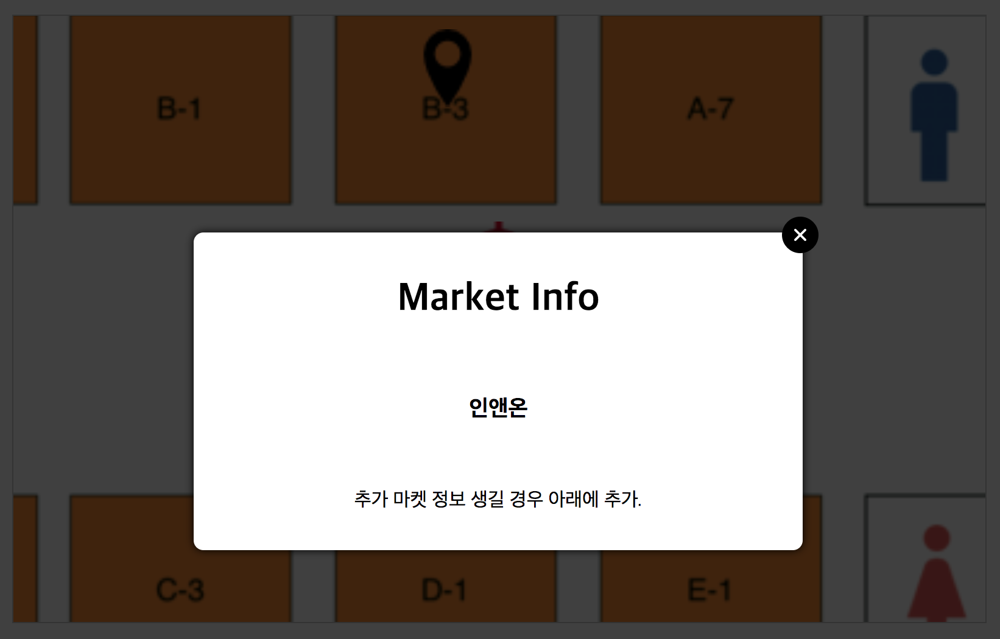
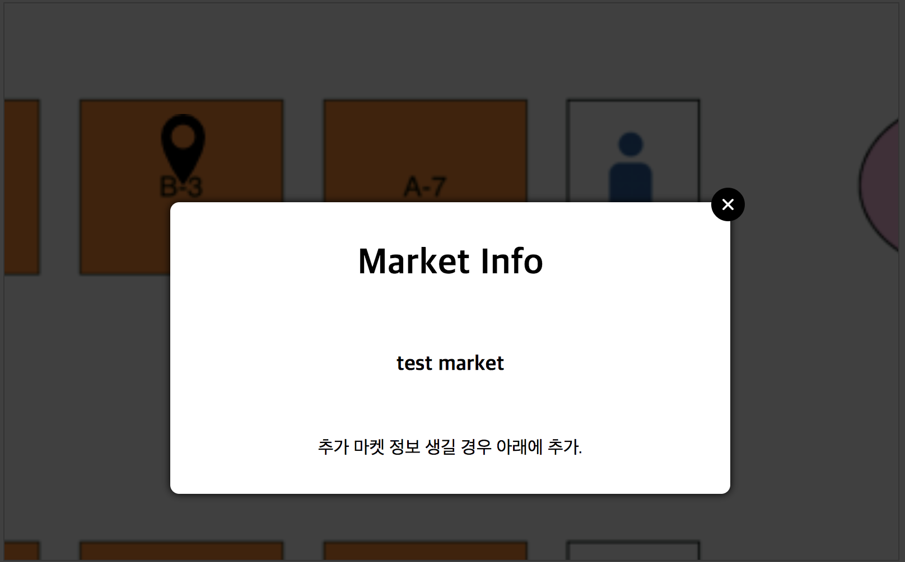

---
# Jisang  Map DEMO
---
지상 어플리케이션의 주 목적은 지하상가 쇼핑을 돕는 것이기 때문에 길을 잃기 쉬운 지하상가의 특성상 지도 서비스를 제공하는 것이 바람직하다고 할 수 있습니다. 앱잼 팀 매칭 날 당시 지상 어플리케이션의 지도 기능 요구사항은 많은 사람들로부터 흥미를 유발했었습니다. 다만 지하상가 특성상 GPS가 제대로 잡히지 않는다는 점, 그 외 팀 내적인 이유로 그 당시 지도 기능은 구현하지 못하였습니다.

당시 지도 기능 구현에 대해 고민하던 클라이언트 팀원들에게 지도 기능을 어떤식으로 구현하면 되는지에 대하여 설명한적이 있었는데 이를 바탕으로 'Spring MVC'로 다시 제작한 지상 어플리케이션에 적용해보았습니다.

(그 당시에 제가 팀원들에게 설명하였던 방식에서 유일한 차이점은 다음과 같습니다. 당시에 저는 지도의 배율을 여러 레벨로 가져갈 경우 배율 레벨 변경 때에 보다 확대된 이미지에 대한 요청, 드래그 이벤트에 따른 화면 이동시에 주변 지역 이미지에 대한 요청을 서버에 수행해야 한다고 하였습니다.(웹의 경우 AJAX 호출, 실제 지도 서비스 기능도 그렇게 진행되는 것 같습니다.) 

그러나 현재(스스로 스프링으로 지상 어플리케이션을 다시 제작) 클라이언트 파트 팀원들이 없는 상황이라 제이쿼리를 이용해 지도 기능의 데모를 구현하는 중인 저의 프론트 실력의 한계(인접한 지도 이미지를 정확하고 끊김없이 연결하는 방법의 간구가 필요.)와 지하상가라는 좁은 특성상 AJAx 호출은 과하다는 생각에 그렇게 하진 않았고 배율은 어떻게 구현할 것인지(AJAX로 확대/축소 시에 이미지를 새로 받아오는 실제 지도 서비스의 기능에도 AJAX 호출 전에 일정한 정도의 확대 및 축소 기능이 존재합니다.)를 보여드리기 위해 마우스가 지도상에 올라갈 때 맵이 일정 비율로 확대될 수 있게 구현하였습니다.

데모인만큼 와이어프레임의 지도와 같이 보다 이쁘고 복잡한 지도는 아닙니다. 현재 7개가 전부인 지상 어플리케이션의 상점 더미 데이터로는 와이어 프레임의 실제 강남 지하상가를 본 딴 지도의 모든 상점을 다 표현하기엔 턱없이 부족한 상황이었고 직접 강남 지하상가와 각 지하상가의 상점의 GPS 주소를 가져오는 구하는 것도 무리가 있다고 판단했기 때문입니다. 

(지도의 중심 GPS를 현재 제가 거주한 강원도 춘천시 퇴계동의 CGV 춘천점의 GPS로 정하였으며 계산 편의를 위하여 지도의 각각의 꼭지점 부분에 대한 GPS는 이미지(데모용으로 그림판으로 만든 지도 이미지)의 크기에 딱 나누어 떨어질 수 있는 지점으로 정하였습니다.)

그러나 데모용으로 사용한 아주 간단한 지도나 와이어프레임과 같은 복잡한 지도나 동작 방식은 동일하기 때문에 데모용 지도로 구현을 보여도 충분하다고 생각하였습니다.

MAP DEMO 
---

아래는 강남 지하상가(더미 마켓 데이터들은 모두 강남 지하상가에 등록한 상점입니다.)의 지역 정보에 대한 데이터베이스 레코드 사진과 현재 더미 데이터로 가지고 있는 각각의 마켓 정보에 해당하는 위치 정보에 대한 데이터베이스 테이블의 사진입니다.

사각형으로 가정한 각 상점 위치 정보의 왼쪽위 - 오른쪽아래 꼭지점의 위/경도 정보를 각각의 칼럼에 저장한tbl_addresses와 달리 지하상가 지역정보를 의미하는 tbl_locations의 지역정보는 MYSQL의 point 데이터 타입을 사용하였습니다. address의 경우 사실 도 단위 정보가 큰 의미가 없고 이 location에서 도 단위 정보를 담고 있기 때문에 분값고 초 값을 초 단위로 저장하였습니다. 
> 이 부분에 착각이 있었는데 혹여나 특정 지하상가가 도 단위가 교차하는 지점에 존재할 경우 아래와 같이 분,초 단위만 저장할 경우 예외가 발생할 수 있습니다.

위 상점 정보 이미지에 빨간색으로 강조된 부분 강남 지하상가 B-3 주소에 존재하는 3번 id를 갖는 마켓에 대한 요청을 할 때의 예입니다. 

검정색 마커는 3번 마켓이 B-3 구역에 위치함을 나타내는 것이며 빨간색 마커의 경우 유저의 현재 위치를 나타내는데 GPS 사용이 불가능한 점을 고려하여 단순히 지하상가의 정 중앙에 유저가 위치하였다고 가정을 하였습니다. 간단한 페이지, 이미지, 좌표의 비율 계산으로 구현가능하기 때문에 이 부분도 실제 GPS 정보가 입력될 수 있다고 할 경우에 동일하게 동작 가능합니다. 맵 화면에 대한 `html` 파일은 `WEB-INF/templates` 하위에 존재합니다(jisangMap.html)

아래는 각 마켓을 클릭할 때 보이는 마켓 정보화면입니다.

> A-7위치에 있는 test market은 포트폴리오 용으로 생성한 마켓입니다. 그 외 나머지 7개의 마켓은 위에서 말씀드렸듯이 앱잼 당시부터 사용해온 더미 데이터입니다.

