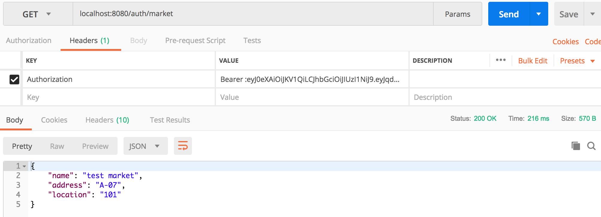
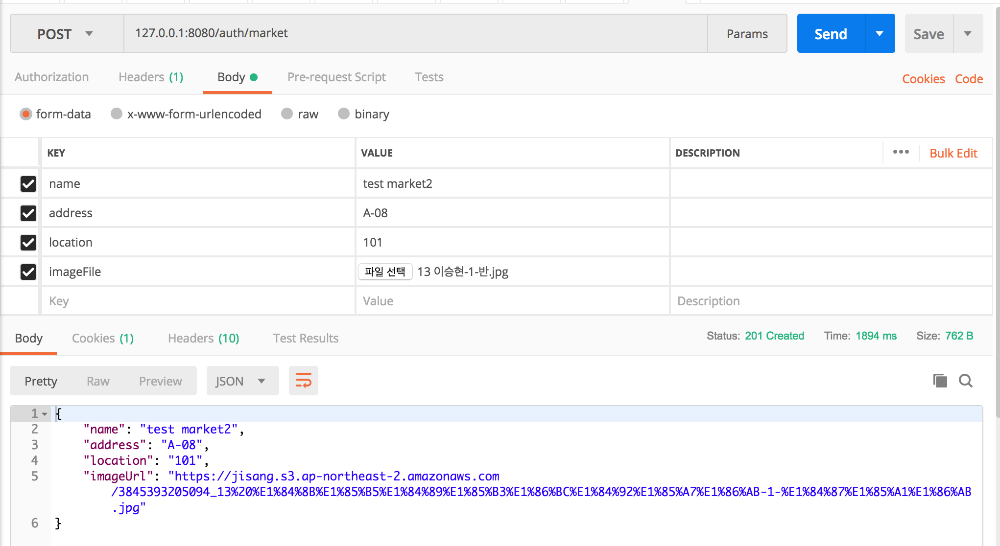
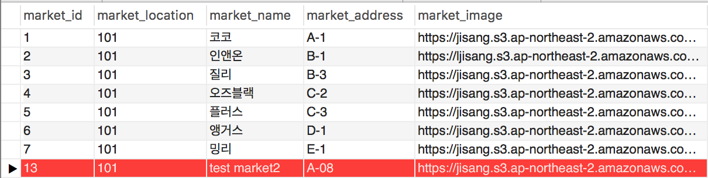

# MarketController 
---
MarketController는 마켓 도메인 관련 요청을 처리하는 요청 핸들러 메서드들이 정의되어 있습니다. 
MarketController 및 market 도메인 관련 보다 더 자세한 내용은 자바 코드의 주석을 통해 다루었습니다.

---
GET /auth/market
---
마켓 수정을 위해 기존 마켓 정보를 불러옵니다.아래는 `POSTMAN`을 이용해 수행한 요청 결과입니다.



현재 `com.jisang.dto.market.MarketManagementDTO.MarketModifyResponseDTO`의 `imageUrl` 프로퍼티에는 
```
			@JsonInclude(JsonInclude.Include.NON_EMPTY)

```
와 같은 애노테이션이 적용되었기 때문에 새로 생성된 마켓 정보의 경우(새로 생성된 마켓 정보에는 이미지가 지정되지 않음.)응답 JSON 바디에 이미지에 대한 url 필드가 존재하지 않습니다.

---
POST /auth/market
---
다음은 마켓 정보 수정에 대한 `POSTMAN` 실행 결과입니다. 수정된 정보가 응답에 다시 보내어짐을 알 수 있습니다.



RDB와 S3에도 데이터가 잘 저장되었음을 알 수 있습니다.





 정보 수정에 `PUT` 메서드가 아닌 `POST` 메서드를 사용하는 이유는 `MarketController`의 메서드 주석에 다루었습니다.
