# ProductController 
---
ProductController는 지상 어플리케이션을 통해 판매되는 상품 도메인 관련 요청을 처리하는 요청 핸들러 메서드들로 구성되어 있습니다. 지상 어플리케이션이 쇼핑몰 어플리케이션인 만큼 다룰 내용이 가장 많습니다.

ProductController 및 product 도메인 관련 보다 더 자세한 내용은 자바 코드의 주석을 통해 다루었습니다.

---
POST /auth/product
---
상품 등록 요청입니다. url이 /auth로 시작하는 이유는 마켓 관리자 계정이 필요하기 때문입니다. 

> /auth/market, /auth/product 이하의 url에는 일반 유저 계정(ROLE_USER)으로는 접근 불가능하며 최소 매니저 계정(ROLE_MANAGER)만 접근 가능합니다.

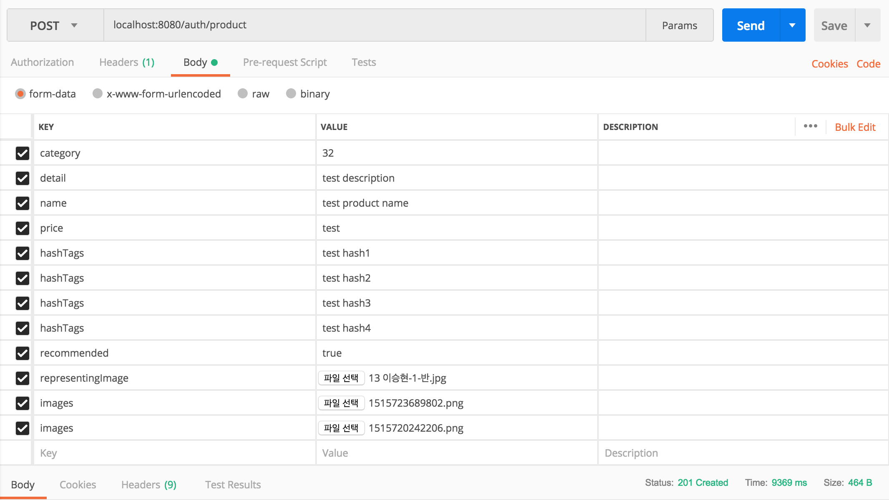

`201 Created` 상태 코드가 응답되었음을 알 수 있습니다. 

>`images` 외에 `representingImage`라는 프로퍼티를 따루 두게 된 이유는 다음과 같습니다. 
지상 어플리케이션 와이어프레임의 대부분을 차지하는 화면이 상품 목록 화면입니다. 만약 `representingImage`와 같은 프로퍼티를 상품 테이블 `tbl_products`의 `product_representing_image`와 같은 칼럼에 저장하지 않았을 경우 매번 상품 목록 조회 요청마다 `JOIN`이 일어나 응답 시간에 영향을 미칠 것이라고 생각하였습니다. 상품 목록이 지연이 심해질 것이라고 생각하였습니다. `JOIN`이 없을 경우에도 select 한 번에 끝날 쿼리가 n+1번 호출되게 됩니다. 
그래서 `representing_image` 칼럼을 `tbl_products`에 둠으로써 정규화를 덜 하기로 결정하였습니다.

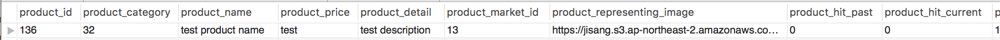

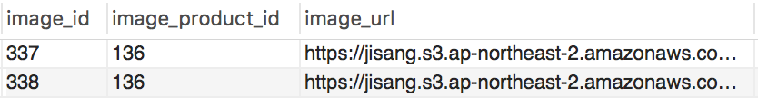

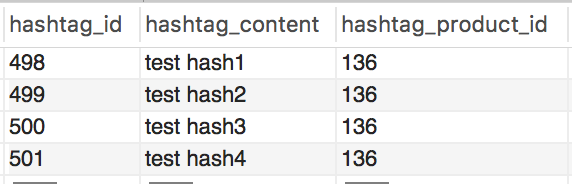

업로드한 데이터가 Mysql db에 저장되었음을 알 수 있습니다.

> 해시 태그와 상품 이미지는 product 도메인을 구성하는 정보입니다만 이들 정보를 고정 칼럼을 통해(image1, image2, ...) 저장할 경우 경우에 따라서 null 값을 갖는 칼럼의 수가 매우 많아질 수 있어 다른 테이블로 빼두게 되었습니다. 

다음은 `elasticsearch`에 해시태그가 잘 업로드 되었는지 bool query(with filter parameter)를 사용하여 검색한 결과입니다.

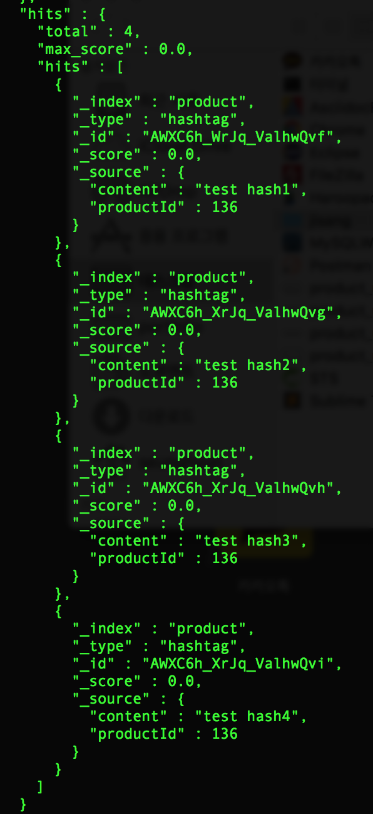

> 기존 Mysql db에 상품, 이미지, 해시태그 정보가 모두 저장되어 있던 것에서 검색어 키워드 미리보기 기능 도입을 위해 해시태그를 `elasticsearch`에 저장하게 되었습니다. 이참에 상품 정보와 연관된 도메인인 마켓 정보까지 `elasticsearch`에 저장할까 고민을 해보았습니다). 이럴 경우 상품 이름 미리보기 키워드 검색과 상품 검색까지 모두 기존 Mysql db 접근을 이용한 구현에서 `elasticsearch` 접근만을 이용해 구현 가능하며 `elasticsearch`의 장점인 search에 특화된 full-text 인덱싱의 장점을 살릴 수 있겠다 싶었습니다.(물론 유연한 타입(document), 클러스터 확장성 등의 다른 장점도 있겠습니다.) 그러나 ROLLBACK과 같은 트랜잭션 지원동작이 제공되지 않는다는 점 등의 한계가 있는 것을 알게되어 좀 더 알아본 후 변경을 해야겠다는 생각에 아직 그렇게 하지는 않았고 우선 해시태그 정보를 엘라스틱서치에 추가로 저장하여 현재 해시태그 미리보기 검색에만 이용되는 중입니다.

---
GET /auth/product/listAll
---

해당 엔드포인트에 대한 핸들러 메서드는 아래 와이어 프레임의 마켓 관리자 화면에 대한 요청을 처리합니다. 

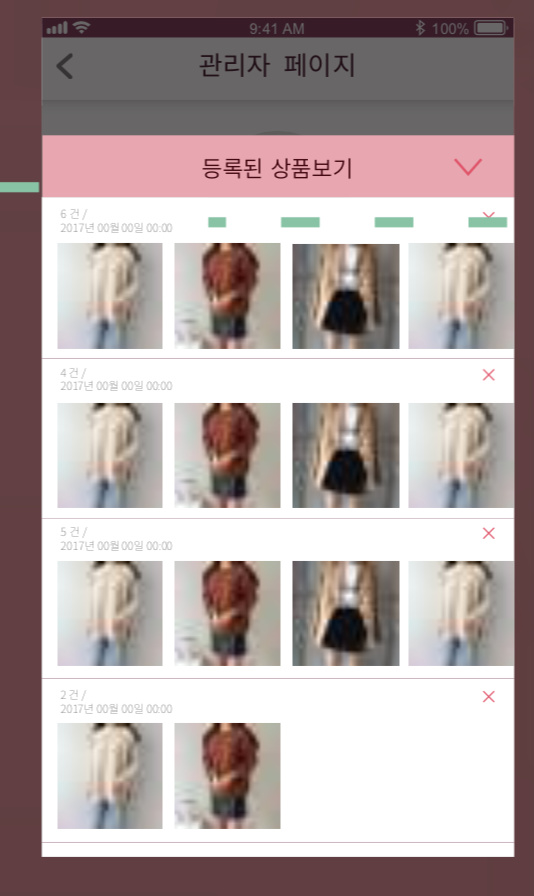

아래는 (가장 많은 상품을 보유하고 있는)id:3 마켓 매니저 계정으로 실행한 `POSTMAN` 결과입니다.

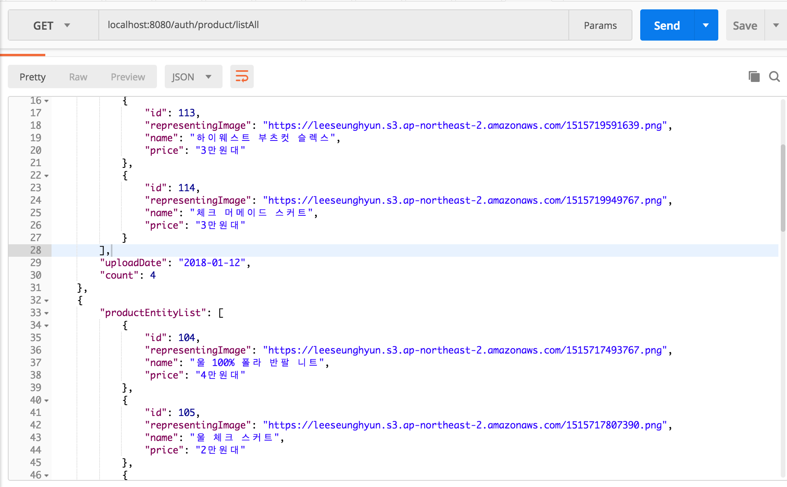

---
### GET /auth/product/list
---

아래의 와이어 프레임 화면에 대한 요청을 처리합니다. 위의 와이어 프레임 화면에서 특정 날짜에 등록된 상품 목록을 선택하면 아래와 같은 화면으로 이동하게 됩니다.

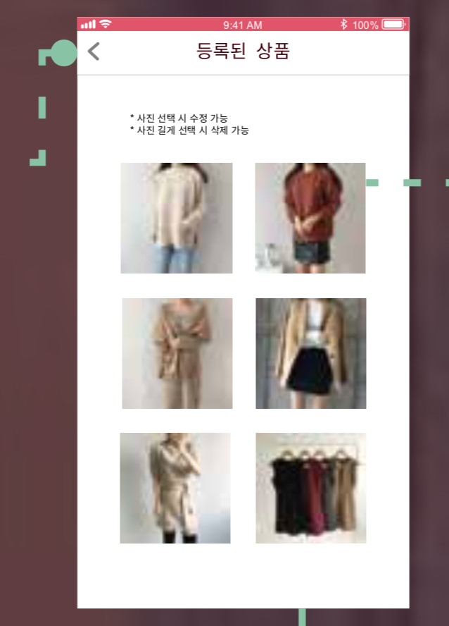

`POSTMAN`으로 시뮬레이션해보면 `2018-01-07`에 등록된 상품 목록이 응답됨을 알 수 있습니다.

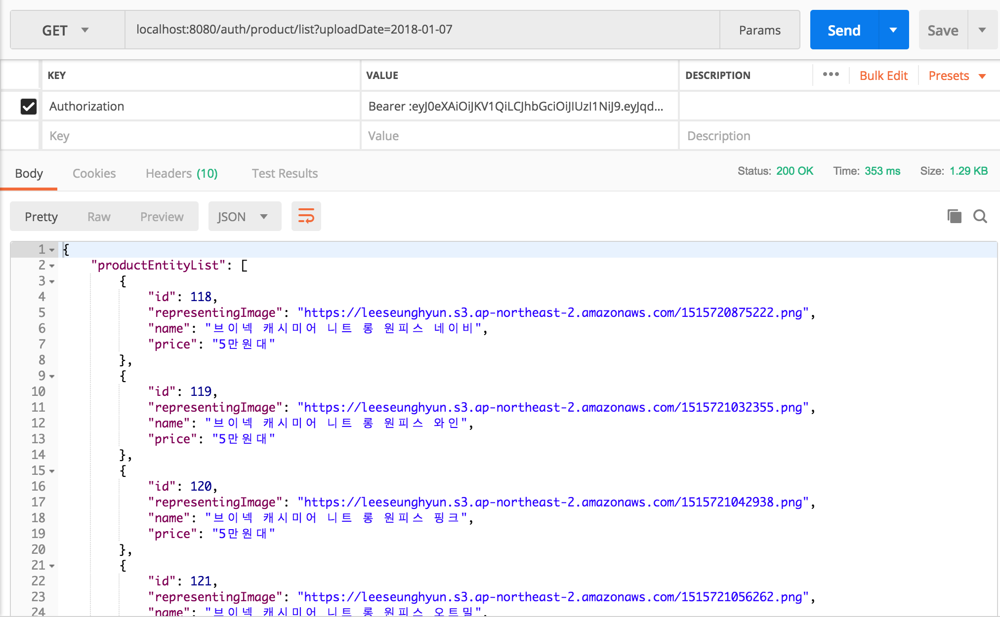

---
### Product List View
---

지상 어플리케이션의 와이어프레임을 보면 대부분의 화면이 상품 목록(쇼핑)화면임을 알 수 있습니다. 

마켓 상품 관리 화면의 상품 목록 화면을 제외하면 지상 어플리케이션에 존재하는 상품 목록의 종류는 다음과 같습니다.

- 일반 화면 (상품 개수가 많아질 것을 고려하여 pagenation을 적용.)

- 베스트 상품 화면

- 추천 상품(MD's pick) 화면 

> 추천 상품의 경우 마켓 상품 수정에서 '해당 상품을 베스트 상품으로 등록하시겠습니까?'에 체크할 경우 추천 상품으로 지정됩니다. `베스트 상품` 용어 때문에 헷갈릴 수 있으나 HIT 점수가 가장 높은 상품을 의미하는 베스트 상품과 다릅니다.

 

위의 세 종류의 화면 타입 외에 카테고리 정보에 따라 출력되는 정보가 다르며 마켓 내의 상품 조회냐 지하상가 상품 조회냐에 따라 출력되는 정보가 다르게 됩니다. 와이어 프레임에 존재하는 화면에 의존적이게 구성할 경우 편할 수는 있으나 후에 화면 타입이 변경될 것을 고려하기로 하였습니다. 

예를 들어, 현재 지상 어플리케이션의 마켓 상품 목록 화면은 보면 상단에 추천 상품 목록과(베스트 라고 되어 있지만 추천 상품입니다.) 하단에 일반 화면으로 구성되어 있습니다. 그러나 기획 팀에서 만약 추천 상품 목록을 베스트 상품 목록으로 바꾸고 싶어할 경우 화면 교체를 고려하지 않았을 경우 서버 코드의 변경이 발생할 수 밖에 없습니다.

서버 코드 변경 없이 클라이언트의 요청에 따라 원하는 상품 뷰를 보여줄 수 있도록 Criteria 클래스를 정의하였으며 대신 마켓 화면이냐 지하상가 화면이냐에 따라 `/market/{marketId}/products`, `/mall/{mallLocation}/products`와 같이 엔드포인트를 둘로 나누었습니다. `viewType`이라는 파라미터에 전달된 값에 따라 필요한 다른 프로퍼티가 전달되었는지를 validation 하므로써 오류가 발생하지 않도록 신경쓰며 구현하였습니다. 

자세한 내용은 소스 코드의 주석에 설명되었습니다.

##### BEST view

아래는 베스트 상품 리스트에 대한 `POSTMAN` 시뮬레이션 결과입니다.

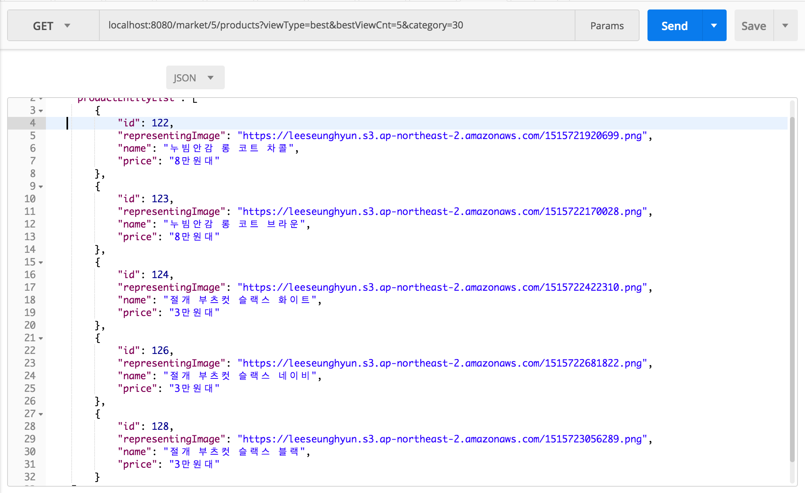

##### RECOMMENDED view

다음은 추천 상품 리스트에 대한 `POSTMAN` 시뮬레이션 결과입니다.

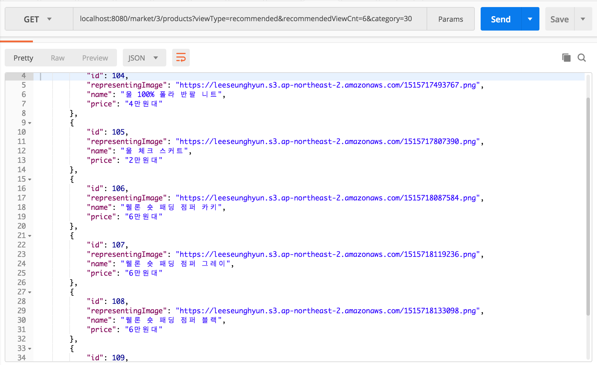

##### PAGE view

마지막으로 일반(페이지 처리) 상품 리스트에 대한 `POSTMAN` 시뮬레이션 결과입니다.

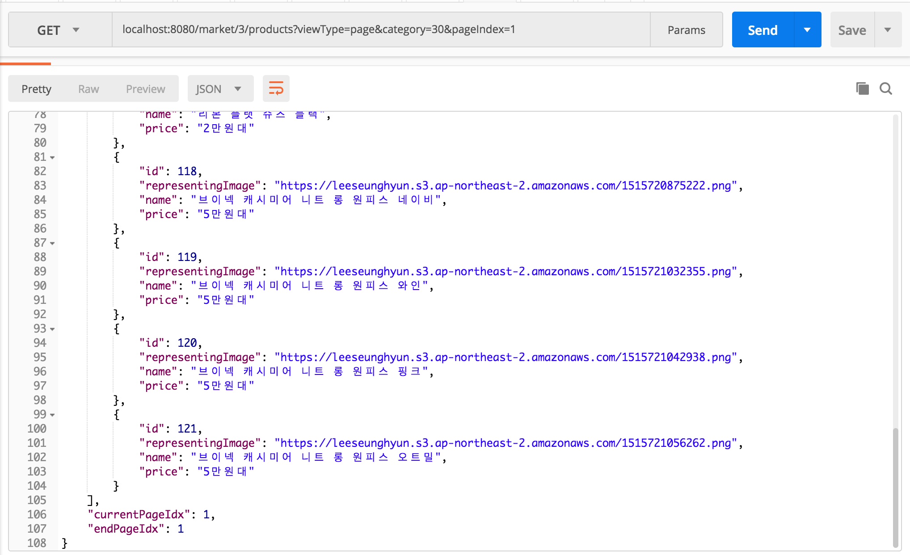

---
Product List View By Search
---

검색을 통한 상품 목록 요청 처리 작업도 바로 위의 상품 목록 화면 처리 작업과 동일한 컴포넌트가 사용됩니다. 사용자는 단지 `searchCriteria.keyword` 요청 변수만 하나 더 추가하여 서버에 전달하면 됩니다.

현재 지상 어플리케이션의 와이어프레임의 검색 화면을 보면 어플리케이션 내의 모든 상품에 대한 검색이 진행됨을 알 수 있습니다. 후에 변경될 여지가 있어 특정 지하상가의 상품 검색, 특정 마켓 상품 검색 등으로 기능을 확장하였습니다.

> 와이어프레임 상의 검색 화면과 같이 전체 어플리케이션 내의 모든 상품에 대한 검색을 수행하려면 바로 아래에 다루는 `지역별 상품 검색` 요청 패스 변수에 지정할 지역 정보를 `CodeBook.MallLocation.ENTIRE_LOCATION` 값으로 지정하면 됩니다. 정확한 값은 `api.md`에 정의되어 있습니다.

##### 지역별 상품 검색

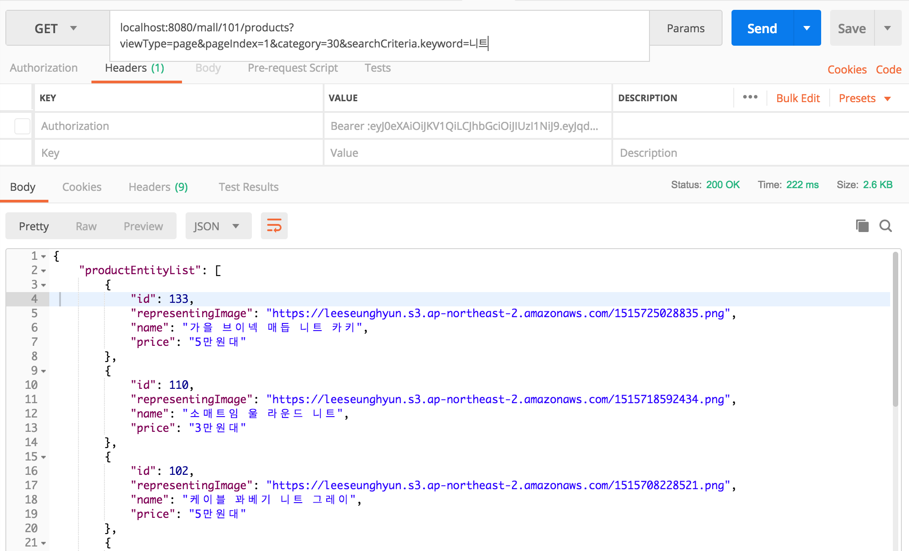

101(강남) 지역 내의 `니트` 키워드로 검색한 상품 목록입니다.

##### 마켓별 상품 검색

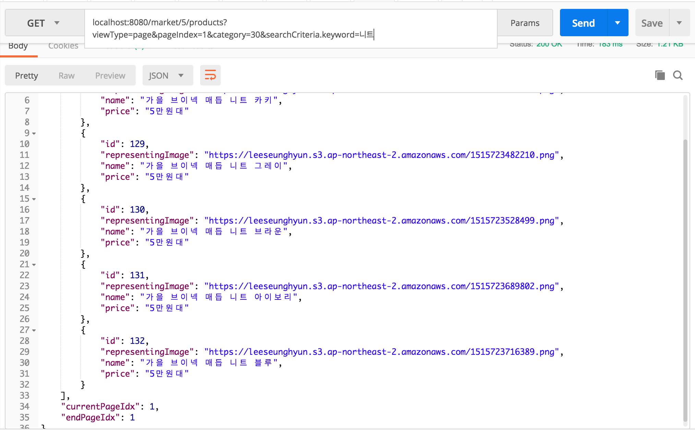

market id:5 마켓 내의 `니트` 키워드로 검색한 상품 목록입니다.
