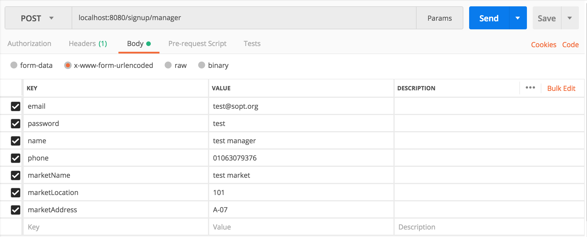
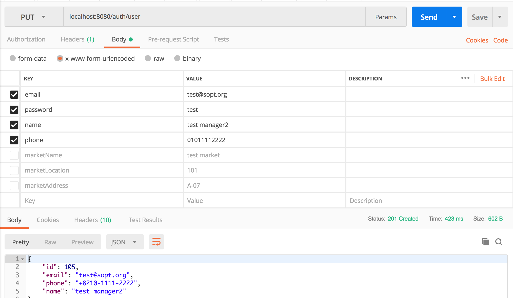

---
# UserController 
---
UserController는 유저 도메인 관련 요청을 처리하는 요청 핸들러 메서드들로 구성되어 있습니다.

UserController 및 user 도메인 관련 보다 더 자세한 내용은 자바 코드의 주석을 통해 다루었습니다.

---
SIGNUP
---
지상 어플리케이션의 회원 가입 기능은 일반 유저 계정 회원 가입(/signup/normal)과 마켓 관리자 계정 회원 가입(/signup/manager)의 두 종류가 있습니다. 아래는 마켓 관리자 계정 회원 가입에 대한 `POSTMAN` 테스트와 결과입니다.

다음으로 실제 데이터가 저장되었는지에 대한 db 레코드 정보를 보이겠습니다.

새로 105번 ID의 유저가 생성되었습니다.

해당 매니저가 관리하는 마켓 정보도 추가되었음을 알 수 있습니다. `market_image`가 null임을 알 수 있는데 지상 어플리케이션의 와이어프레임 회원 가입 화면을 보면 알 수 있듯 마켓의 이미지 등록은 마켓 정보 수정을 통해 가능합니다.

다음과 같이 매니저와 마켓 간의 관계를 저장하는 테이블 tbl_managements에도 새 레코드가 추가되었음을 알 수 있습니다. 

>tbl_users에 마켓 id를 가리키는 foreign key를 또는 tbl_markets에 관리자 id를 가리키는 foreign key를 지정하지 않은 이유는 com.jisang.persistence.managementDAO에 설명하였습니다.

---
### GET /auth/user
---
다음은 유저 정보에 대한 변경 전에 기존 정보에 대한 GET 요청에 대한 `POSTMAN` test 결과입니다. 지상 어플리케이션의 와이어프레임에는 없으나 너무 당연히 존재해야 할 부분이라 추가하였습니다. 

위 사진을 보면 `200 OK` 상태 메세지와 방금 회원 가입한 사용자의 정보가 전달됨을 알 수 있습니다. `Authorization` 헤더 필드는 com.jisang.security.README.MD에서 설명하였듯 `/auth` 이하의 모든 엔드포인트에 대하여 JWT 토큰 인증을 수행을 위해 클라이언트에서 서버로 전달하여야 하는 JWT 토큰입니다.

---
PUT /auth/user
---

다음은 유저 정보 수정을 담당하는 엔드포인트 PUT `/auth/user`에 대한 `POSTMAN` 테스트 결과입니다.

위의 사진을 보면 알 수 있듯 유저의 정보가 변경되었음을 알 수 있습니다. `201 Created`가 반환된 이유는 변경된 유저정보를 다시 사용자에게 전달하기 때문입니다. 

user_id : 105인 유저에 대한 레코드가 변경되었음을 알 수 있습니다.

---
GET /temporary-password
---
임시 비밀 번호 발급은 com.jisang.security.README.MD에 다루었습니다.

